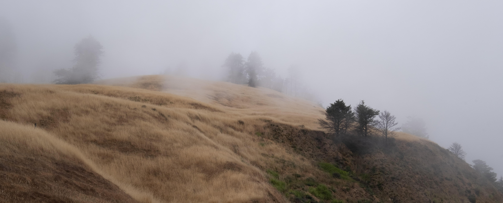

I am a PhD Candidate in Transportation Systems Analysis and Planning at Northwestern University. In the [*Mobility and Behavior Lab*](https://www.amandastathopoulos.com/), I study how people change their travel behavior and preferences, especially in response to policy interventions like transit safety measures. You can see more in the [Projects](/projects.html) tab. I'm also interested in using Bayesian methods in transportation research and demand modeling in general. As of Fall 2023, I am an NSF Graduate Research Fellow. I received my B.A. in Physics from Goshen College (Goshen, IN) in 2019. 

When I am not doing research, I like to play soccer, take photos, ride my bike, [listen to music](https://www.last.fm/user/aesch_spencer), read, and cook.

<figcaption class="about_img_caption"><i>Highway 1 near Fort Ross, CA. June 2021</i></figcaption>

 

#### *Books, Music, and Movies I've Recently Enjoyed*

- [Thomas Pynchon, *Mason & Dixon*](https://pilsencommunitybooks.com/item/kFvBjdPm05GNT1534IqE5g)
- [Helen DeWitt, *The Last Samurai*](https://pilsencommunitybooks.com/item/hvTabYmi136pjSBDRz8N7w)
- [Solvej Balle, *On The Calculation of Volume*](https://pilsencommunitybooks.com/item/hvTabYmi134bS1DyXBK8Pg) (tr. Barbara J Haveland)
- [Don DeLillo, *Mao II*](https://pilsencommunitybooks.com/item/lyBOwW8q0va-Nk8mwd9cbg)
- [Roberto Bolaño, *By Night In Chile*](https://pilsencommunitybooks.com/item/MWp_c1qAP1yhJ1YRJd3wFg) (tr. Chris Andrews)

- [caroline - *caroline 2*](https://caroline.bandcamp.com/album/caroline-2)
- [Chuquimamani-Condori - *DJ E*](https://chuquimamani-condori.bandcamp.com/album/dj-e)
- [Hana Stretton - *tiarn*](https://hanastretton.bandcamp.com/album/tiarn-2)
- [Kelela - *new avatar*](https://kelela.bandcamp.com/album/new-avatar-2)
- [Sluice - *Companion*](https://sluice.bandcamp.com/album/companion)

- [*A Brighter Summer's Day*](https://letterboxd.com/film/a-brighter-summer-day/), dir. Edward Yang
- [*Blue Heron*](https://letterboxd.com/film/blue-heron/), dir. Sophy Romvari
- [*The Secret Agent*](https://letterboxd.com/film/the-secret-agent-2025/), dir. Kleber Mendonca Filho
- [*Magellan*](https://letterboxd.com/film/magellan-2025/), dir. Lav Diaz
- [*Caught by the Tides*](https://letterboxd.com/film/caught-by-the-tides/), dir. Jia Zhangke