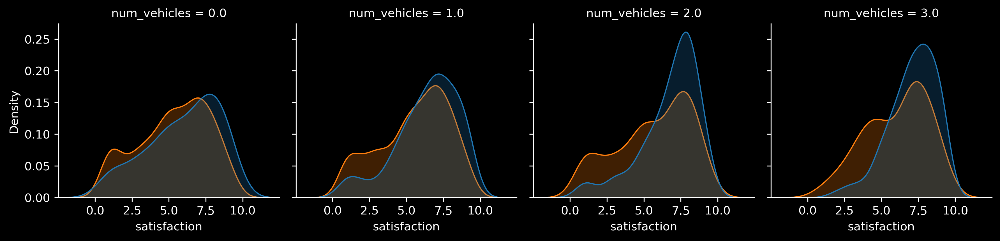

## *Effects of transit safety measures*

Lorem ipsum dolor sit amet, consectetur adipiscing elit, sed do eiusmod tempor incididunt ut labore et dolore magna aliqua. Pharetra diam sit amet nisl suscipit adipiscing bibendum. Ultricies mi eget mauris pharetra. Viverra ipsum nunc aliquet bibendum. Vel orci porta non pulvinar neque. Neque volutpat ac tincidunt vitae semper quis. Sit amet consectetur adipiscing elit duis tristique sollicitudin nibh sit. Proin gravida hendrerit lectus a. Egestas fringilla phasellus faucibus scelerisque eleifend donec. Faucibus in ornare quam viverra orci sagittis eu volutpat. Massa sed elementum tempus egestas sed sed. Sed odio morbi quis commodo odio aenean sed adipiscing. Massa enim nec dui nunc mattis enim.

Elit ullamcorper dignissim cras tincidunt lobortis feugiat. Quisque non tellus orci ac. Maecenas pharetra convallis posuere morbi leo urna molestie at. Morbi blandit cursus risus at ultrices mi tempus. Est pellentesque elit ullamcorper dignissim cras tincidunt lobortis. Cras ornare arcu dui vivamus arcu felis bibendum ut. Morbi blandit cursus risus at ultrices. Neque sodales ut etiam sit amet nisl purus in mollis. Tristique senectus et netus et malesuada. Nulla malesuada pellentesque elit eget. Eu feugiat pretium nibh ipsum consequat nisl vel pretium. Volutpat commodo sed egestas egestas fringilla phasellus faucibus. Tincidunt augue interdum velit euismod in pellentesque massa placerat duis. Ut etiam sit amet nisl.

## *Determinants of planned RTT times*

