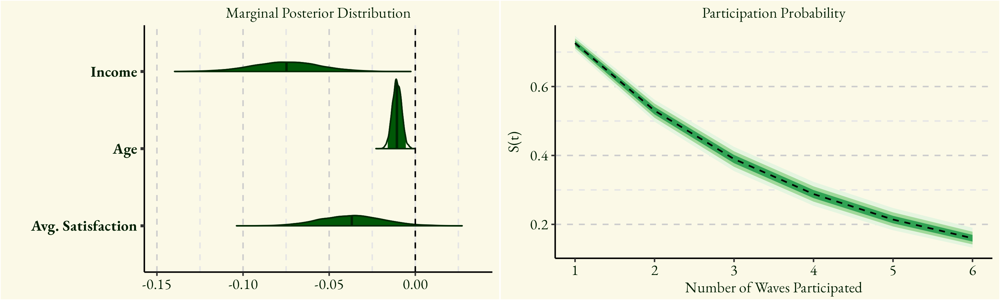
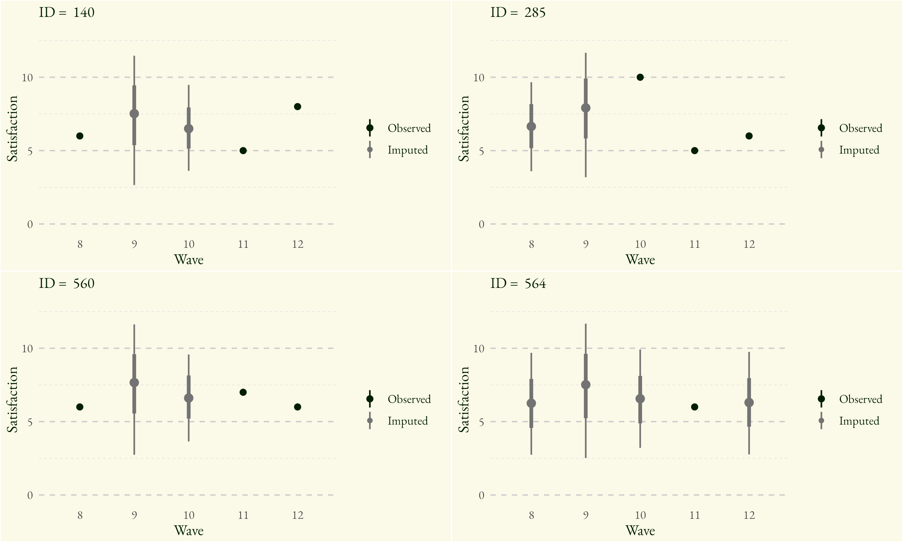

  

### *Choice and Survival Analysis of Transit Panel Survey Participation*

In the context of transit behavior, systematic missing data in key outcome variables can significantly bias survey findings, particularly when analyzing changes over time. 
This study investigates patterns of attrition in a transit panel survey using two complementary Bayesian modeling approaches: a hierarchical choice model and a survival model. The choice model captures participants’ repeated, active decisions to respond to each survey wave, while the survival model emphasizes the temporal dynamics of continued participation and dropout. 
By distinguishing between decision-based and time-based mechanisms of attrition, our approach offers a more robust understanding of survey engagement and highlights the importance of accounting for complex missingness patterns in longitudinal transit research.

{: .project-image}

  

  

    I presented a version of this project (and the one below) at <a href="https://transportation.northwestern.edu/news-events/itea2025/itea2025.html">ITEA 2025</a> (Evanston, IL) and will present more at <a href="https://whova.com/web/b0kitYLTonIzVU26vERb8gXZi%404PmOCqTY6zxshGkPQ%3D">MoMo 2025</a> (Minneapolis, MN).
  

  

### *Fully-Bayesian Imputation for Transit Panel Survey Data*

With increased availability of panel data on transit riders, agencies have more access than ever to information on changing rider behaviors and perceptions over time.
However, these data can be rife with issues, the primary of which is missingness on important outcome variables such as rider satisfaction.
Despite the temptation to run analyses only on complete cases, doing so can provide seriously biased estimates and a misleading view of the true trends in the perceived state of the transit service.
Do address this challenge, we implement a principled approach to data imputation that is flexible, time-varying, and robust to uncertainty.
Underlying this framework is a temporal Gaussian process that accounts for non-linearities in both global and individual satisfaction trends.
Instead of throwing away useful data, we now have a joint hierarchical framework that imputes missing values and estimates effects of predictors all in one estimation procedure.
In this Bayesian framework, uncertainty in both imputed values and parameter estimates are naturally propagated throughout the model, resulting in insights and predictions that share information between respondents and regularize to prevent overfitting.

{: .project-image}

  

      

    I presented a version of this project (and the one above) at <a href="https://transportation.northwestern.edu/news-events/itea2025/itea2025.html">ITEA 2025</a> (Evanston, IL) and will present more at <a href="https://whova.com/web/b0kitYLTonIzVU26vERb8gXZi%404PmOCqTY6zxshGkPQ%3D">MoMo 2025</a> (Minneapolis, MN).
  

  

### *Trade-offs in transit safety policy*

Implementing effective safety interventions on public transit is complicated by the mixed rider experiences with, and perceptions of, crime and law enforcement. Transit agencies can design more effective policy interventions if they understand what shapes riders' reactions to different safety strategies, and how those strategies can promote rider satisfaction. Using a 2023 survey of 2292 transit riders in the Chicago region, we estimate a Bayesian Structural Equation Model to investigate the connections between rider experiences and demographics, receptiveness to safety measures, and overall satisfaction. We find that enforcement-related strategies are most strongly associated with higher overall rider satisfaction, but they also come with the notable downside of 10-20% of riders feeling less safe. On the other hand, improvements to various facets of service quality are less strongly related to satisfaction, but they come with little to no downside in terms of negative rider perceptions. Rider experience also plays a role, with more severe crime and nuisance experience directly impacting satisfaction. In contrast, indirect knowledge of transit safety issues obtained from media and hearsay primarily affects riders' support for safety interventions rather than their overall satisfaction.

{: .project-image}

  

  

    <a href="https://www.sciencedirect.com/science/article/pii/S0965856425002125?casa_token=tKSIIDdmDvcAAAAA:paIUL92wWQ-bM_XJal0g9EnViuKugCxk7Z5y91794Z-PAKJcZEjB2pl6Fpsydt4ZANz5Dc0">Link to paper</a>
  

 

### *Plurality of subjective equity ideals among transit riders*

Transportation equity is built on the foundation of distributing the benefits and costs resulting from policies and plans in a fair, just, and inclusive manner. However, with the varied and sometimes vague normative interpretations and definitions of equity, there remains a lack of clarity on what equity truly means for different stakeholders. Subjective viewpoints of equity within the public remain largely unexplored, leaving a critical gap in the understanding of societal expectations of transportation equity. This article investigates the subjective equity viewpoints of transit users. The goal of this research is to examine diverse user perceptions of equity standards informed by distributive justice theories, which describe how society should distribute transit benefits among users.

<a href="https://www.sciencedirect.com/science/article/pii/S0967070X25002355?casa_token=st9CqSsatDIAAAAA:Pigyfd0B5wcgMh4tpLiiLIff7A34eBeh3sG2r_V9eALkUHbgHpVWKQtYAwjw08h-vEXICEY">Link to paper</a>

