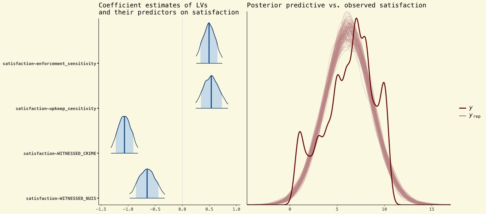

  

### *Trade-offs in transit safety policy*

Implementing effective safety interventions on public transit is complicated by the mixed rider experiences with, and perceptions of, crime and law enforcement. Transit agencies can design more effective policy interventions if they understand what shapes riders' reactions to different safety strategies, and how those strategies can promote rider satisfaction. Using a 2023 survey of 2292 transit riders in the Chicago region, we estimate a Bayesian Structural Equation Model{{sidenote: estimated using the `lavaan` package in R}} to investigate the connections between rider experiences and demographics, receptiveness to safety measures, and overall satisfaction. We find that enforcement-related strategies are most strongly associated with higher overall rider satisfaction, but they also come with the notable downside of 10-20% of riders feeling less safe. On the other hand, improvements to various facets of service quality are less strongly related to satisfaction, but they come with little to no downside in terms of negative rider perceptions. Rider experience also plays a role, with more severe crime and nuisance experience directly impacting satisfaction. In contrast, indirect knowledge of transit safety issues obtained from media and hearsay primarily affects riders' support for safety interventions rather than their overall satisfaction.

{: .project-image}

  

  

    <a href="https://papers.ssrn.com/sol3/papers.cfm?abstract_id=4989514">Link to paper</a>
  

 

### *Plurality of subjective equity ideals among transit riders*

Transportation equity is built on the foundation of distributing the benefits and costs resulting from policies and plans in a fair, just, and inclusive manner. However, with the varied and sometimes vague normative interpretations and definitions of equity, there remains a lack of clarity on what equity truly means for different stakeholders. Subjective viewpoints of equity within the public remain largely unexplored, leaving a critical gap in the understanding of societal expectations of transportation equity. This article investigates the subjective equity viewpoints of transit users. The goal of this research is to examine diverse user perceptions of equity standards informed by distributive justice theories, which describe how society should distribute transit benefits among users.

<a href="https://www.sciencedirect.com/science/article/pii/S0967070X25002355?casa_token=st9CqSsatDIAAAAA:Pigyfd0B5wcgMh4tpLiiLIff7A34eBeh3sG2r_V9eALkUHbgHpVWKQtYAwjw08h-vEXICEY">Link to paper</a>

